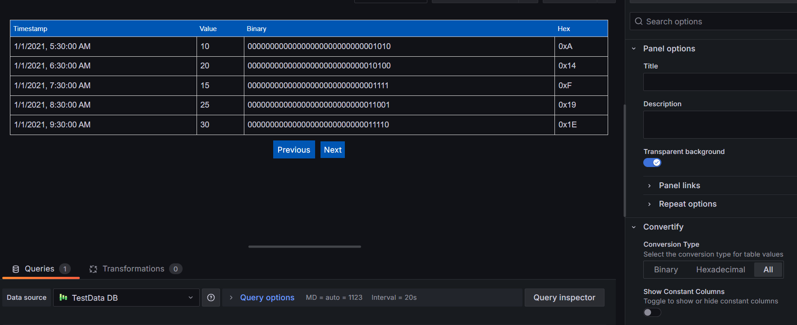

# Convertify Panel for Grafana

**Convertify** is a powerful panel plugin for Grafana designed to help visualize real-time data with detailed bit-level analysis. It integrates with Grafana's time-series data and transforms it into binary or hexadecimal representations. This plugin is perfect for monitoring and analyzing data with bitfield structures, such as industrial systems, IoT devices, or control systems.

### Features

- **Real-time Data Visualization**: Visualizes time-series data from Grafana.
- **Binary and Hexadecimal Conversion**: Convert numerical values into binary or hexadecimal formats.
- **Bit-Level Representation**: Show bit-level status using predefined bitfields (e.g., Status, Stop, Emergency Stop).
- **Column Filtering**: Apply dynamic filters to the columns and analyze data based on specific conditions.
- **Pagination**: Data is displayed in pages, making it easy to navigate large datasets.
- **Flexible Data Input**: Works with any time-series data with numerical values.

### How It Works

The panel works by transforming numerical values into binary or hexadecimal formats and displaying them in a table along with their corresponding bitfield values. 

**Key Concepts:**
- **Binary Conversion**: Each numerical value is converted into a 32-bit binary representation.
- **Hex Conversion**: The panel can also convert values into a hexadecimal format.
- **Bitfields**: Each value is analyzed according to predefined bitfields (e.g., Status, Stop, Fault Stop), where each bit represents a specific status (set or clear).

### Expected Data Format

For the plugin to work, you need a time-series dataset that contains both time and numerical fields. Here's an example of the expected data:

| Timestamp           | Value |
|---------------------|-------|
| 2025-01-01 12:00:00 | 1024  |
| 2025-01-01 12:01:00 | 2048  |

- **Time**: A field containing timestamp data (required).
- **Value**: A numerical field representing the data to be visualized (required).
  
### Using the Plugin

1. **Install the Plugin**: Download and install the Convertify panel from the Grafana plugin marketplace.
2. **Add the Panel to a Dashboard**: Once installed, add the Convertify panel to your dashboard like any other panel.
3. **Configure the Data Source**: Choose a data source that provides time-series data with numerical values.
4. **Select Conversion Type**: Choose whether to visualize the data as binary, hexadecimal, or both.
5. **Use Filters**: Apply filters to view data for specific bitfields.
6. **Navigate through Pages**: Use the pagination buttons to navigate through large datasets.

### Screenshots

**Example Display**: The table will show the data with columns for the timestamp, value, and additional bit-level fields. 

### Configuration Options

- **Conversion Type**: Choose whether to display the data in binary, hexadecimal, or both formats.
- **Show Constant Columns**: Toggle to show or hide the bitfield columns for status monitoring.
- **Column Filters**: Apply filters to narrow down the data based on bitfield values.

### License

This plugin is licensed under the MIT License. See the [LICENSE](LICENSE) file for more details.

